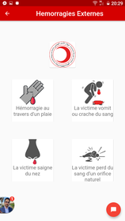

# app-croissant-rouge


### First aid flutter Mobile Application  that gives you the possibility toreach out a close rescuer in case of anemergency for the benefit of red crescent soukra committee . 

<p align="center">
  
  
  
  
</p>

# how to contribute to this project:
1. Clown this project
2. Check out to your branch

```
git checkout <branch name>
 exp: git checkout sprint1/home
```

3. start working on that banch 
4. when you done push to you branch 

```
git push origin <branch name>
 exp: git push origin sprint1/home
```
# architecture:

* lib:
  * models  
  * views:
    * screens
    * widgets
  * services
 

# useful tip:
before you start working on your branch after the first time, pull the branch you are working on.

```
git pull origin <branch name>
 exp: git push origin sprint1/home
```
